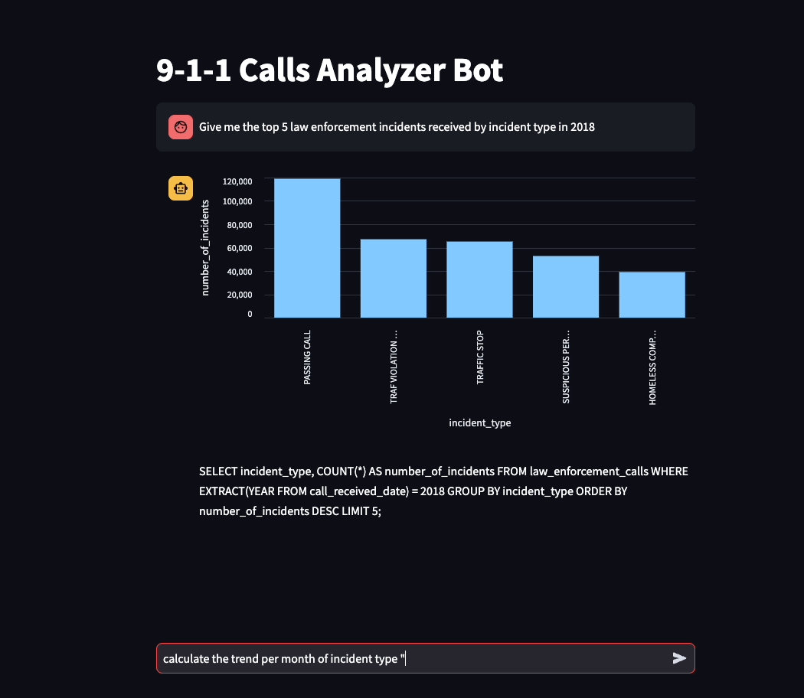

# 9-1-1 Call Records Analyzer Bot
A chatbot that understands natural language questions and queries the sql database which loaded with call records of calls received to the 911 number in San Francisco. The Streamlit application makes calls to a Large Language model (da-vinci model from OpenAI) to create the SQL query required to query the database from a natural language query received from the user. The results are visually represented to the user as shown below. This is an art of the possible demo, not intended for production use and does not satisfy all kinds of requests. Feel free to download the code and make changes, the notebooks are also provided to transform the data to the required database table format. Apache Spark is used for data transformation and the Postgres driver is used to ingest data from Apache Spark to Postgres.
### pyspark --packages io.delta:delta-core_2.12:2.4.0 --conf "spark.sql.extensions=io.delta.sql.DeltaSparkSessionExtension" --conf "spark.sql.catalog.spark_catalog=org.apache.spark.sql.delta.catalog.DeltaCatalog" --jars "/Users/simith/Downloads/postgresql-42.6.0.jar"

Debugging can be enabled by setting the flag DEBUG to ON in the .streamlit/secrets.toml file. That will show the SQL query that was generated by the LLM (OpenAI in this case) in the chatbot interface. 
Bote: This is just 

