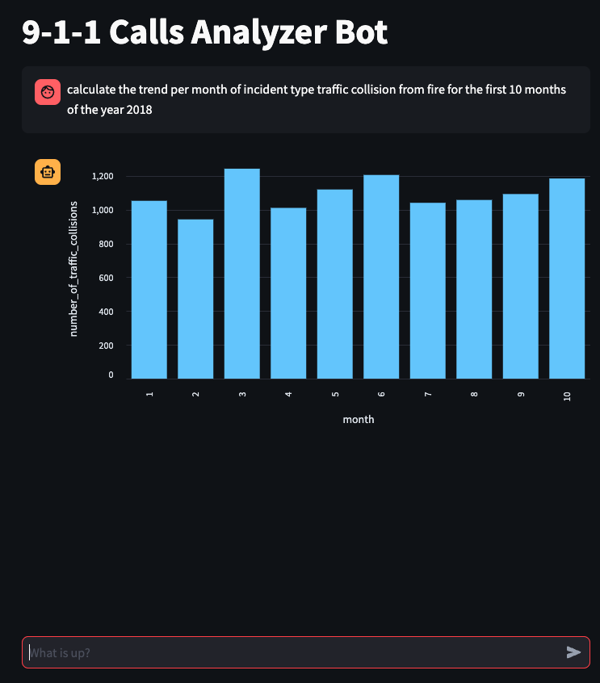
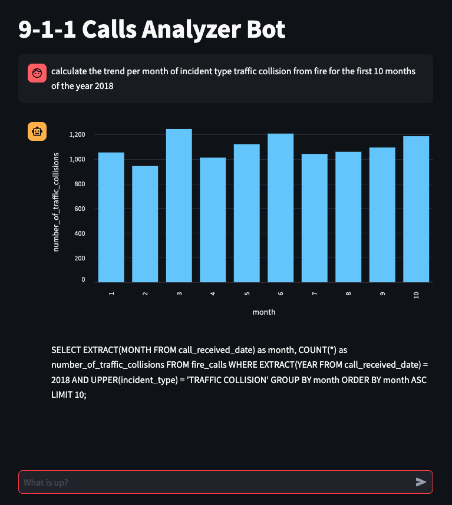

# 9-1-1 Call Records Analyzer Bot
A chatbot that understand natural language and queries the sql database to get data and present it visually - using LLM's

Debugging can be enabled by setting the flag DEBUG to ON in the .streamlit/secrets.toml file. That will show the SQL query that was generated by the LLM (OpenAI in this case) in the chatbot interface. 
Bote: This is just 

